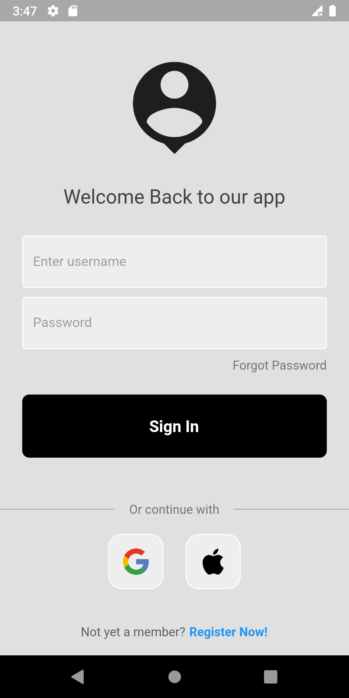

# Simple Login

This project is a simple login page. Wanted to try out authentication with spring boot too

## Dependencies
- [x] None for now

## Help
A few resources to get you started with Flutter

- [Lab: Write your first Flutter app](https://docs.flutter.dev/get-started/codelab)
- [Cookbook: Useful Flutter samples](https://docs.flutter.dev/cookbook)
- The Flutter [online documentation](https://docs.flutter.dev/), which offers tutorials, samples, guidance on mobile development, and a full API reference.

## Screenshots

